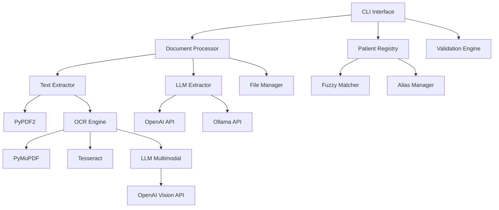

# 🏥✨ Software Requirements Specification (SRS)
**Versão 2.0 - CliniKondo**  
*Data: 17 de Outubro de 2025*

## 🏷️ Sistema: CliniKondo - O Assistente de Organização Médica

### 📘 Visão Geral do Produto

**CliniKondo** é o assistente que transforma o caos de exames, receitas e laudos em pura harmonia digital! 🎯

Com leveza, humor e método, CliniKondo organiza os documentos médicos da sua família de forma inteligente — cada PDF encontra seu lugar perfeito e traz um pouco de alegria à pasta!

**Sistema de linha de comando (CLI)** multiplataforma com arquitetura moderna para:

- 🤖 **Classificação automática** de documentos médicos via LLM (OpenAI/Ollama)  
- 🔍 **OCR inteligente** para PDFs escaneados e imagens médicas (tradicional ou multimodal)
- 📁 **Organização hierárquica** por paciente, tipo e especialidade
- 👥 **Sistema avançado de pacientes** com fuzzy matching e aliases
- 🛡️ **Validações robustas** com correção automática de problemas
- 📊 **Comandos especializados** para gestão, relatórios e auditoria
- 🔒 **Preservação total** dos arquivos originais por padrão

### 🎯 Objetivos do Sistema

| Objetivo | Descrição | Critério de Sucesso |
|----------|-----------|-------------------|
| **Organização Automática** | Classificar e organizar documentos médicos sem intervenção manual | ≥ 90% de precisão na classificação |
| **Inteligência de Pacientes** | Identificar e reconciliar nomes de pacientes com variações | ≥ 95% de acurácia incluindo fuzzy matching |
| **Processamento Robusto** | Extrair texto de PDFs escaneados e imagens automaticamente | 100% dos PDFs sem texto processados via OCR |
| **Interface Profissional** | CLI moderna com comandos especializados e feedback claro | 7 comandos principais totalmente funcionais |
| **Segurança de Dados** | Preservar arquivos originais e validar integridade | 100% dos originais preservados por padrão |

---

## 🏗️ Arquitetura do Sistema

### 📦 Componentes Principais



### 🎯 Fluxo de Processamento

1. **Validação de Entrada** → Tamanho, formato, caracteres seguros
2. **Extração de Texto** → PyPDF2 ou OCR automático (PyMuPDF + Tesseract ou LLM multimodal)
3. **Processamento LLM** → Classificação via prompt estruturado
4. **Reconciliação de Paciente** → Fuzzy matching ou criação automática
5. **Organização Final** → Renomeação, estrutura hierárquica, cópia/movimento

---

## 🧱 Especificação de Entidades

### 📄 1. Documento Médico

| Campo | Tipo | Obrigatório | Descrição |
|-------|------|-------------|-----------|
| `caminho_entrada` | Path | ✅ | Caminho original do arquivo |
| `nome_arquivo_original` | string | ✅ | Nome original preservado |
| `formato` | enum | ✅ | Extensão (.pdf, .png, .jpg, .jpeg, .tif, .tiff, .heic, .txt) |
| `tamanho_bytes` | int | ✅ | Tamanho do arquivo (máx: 50MB) |
| `hash_sha256` | string | ✅ | Hash para detecção de duplicatas |
| `texto_extraido` | string | ✅ | Texto via PyPDF2, OCR tradicional ou multimodal |
| `metodo_extracao` | enum | ✅ | "pypdf2", "ocr_traditional", "ocr_multimodal" |
| `ocr_aplicado` | bool | ✅ | Se OCR foi necessário |
| `paginas_processadas` | int | ❌ | Número de páginas (PDFs) |
| `chars_extraidos` | int | ✅ | Caracteres de texto extraídos |
| `llm_resposta` | dict | ✅ | Resposta estruturada do LLM |
| `nome_paciente_inferido` | string | ✅ | Nome identificado pelo LLM |
| `data_documento` | date | ✅ | Data extraída do conteúdo |
| `tipo_documento` | enum | ✅ | Categoria (exame, receita, vacina, etc.) |
| `especialidade` | string | ❌ | Área médica relacionada |
| `descricao_curta` | string | ❌ | Descrição resumida (≤60 chars) |
| `confianca_extracao` | float | ✅ | Confiança LLM (0.0-1.0) |
| `nome_arquivo_final` | string | ✅ | Nome padronizado gerado |
| `caminho_destino` | Path | ✅ | Localização final organizada |
| `paciente_slug` | string | ✅ | Slug do paciente associado |
| `tempo_processamento_ms` | int | ✅ | Duração total do processamento |
| `tentativas_llm` | int | ✅ | Número de tentativas LLM |
| `log_processamento` | dict | ✅ | Log estruturado completo |

#### Regras de Validação

- **Formatos Suportados**: `.pdf`, `.png`, `.jpg`, `.jpeg`, `.tif`, `.tiff`, `.heic`, `.txt`
- **Tamanho Máximo**: 50MB por arquivo
- **Caracteres Seguros**: Detecção e correção automática de nomes problemáticos
- **Arquivos Obrigatórios**: Rejeita arquivos vazios ou corrompidos
- **Detecção de Duplicatas**: Hash SHA-256 para identificação única

#### Padrão de Nomenclatura Final

```
AAAA-MM-DD-nome_paciente-tipo_documento-especialidade-descricao.ext
```

**Exemplo**: `2025-10-17-joao_silva_santos-exame-cardiologia-eletrocardiograma.pdf`

**Regras**:
- Minúsculas, sem acentos, underscores como separadores
- Máximo 150 caracteres totais
- Compatível com todos os sistemas de arquivos
- Data sempre no formato ISO (AAAA-MM-DD)

---

### 👤 2. Paciente

| Campo | Tipo | Obrigatório | Descrição |
|-------|------|-------------|-----------|
| `nome_completo` | string | ✅ | Nome principal do paciente |
| `slug_diretorio` | string | ✅ | Identificador único (ex: `joao_silva_santos`) |
| `nomes_alternativos` | List[string] | ❌ | Aliases e variações conhecidas |
| `genero` | enum | ❌ | "M", "F", "O" (masculino, feminino, outro) |
| `data_nascimento` | date | ❌ | Data de nascimento |
| `data_criacao` | datetime | ✅ | Quando foi registrado no sistema |
| `data_ultima_atualizacao` | datetime | ✅ | Última modificação |
| `documentos_count` | int | ✅ | Número de documentos associados |
| `confianca_nome` | float | ✅ | Confiança na identificação (0.0-1.0) |
| `origem_criacao` | enum | ✅ | "llm_extraction", "manual_add", "fuzzy_match" |

#### Sistema de Fuzzy Matching

- **Algoritmo**: `difflib.SequenceMatcher` do Python
- **Threshold Padrão**: 0.8 (configurável)
- **Normalização**: Remove acentos, converte para minúsculas, padroniza espaços
- **Priorização**: Correspondência exata > fuzzy matching > criação nova
- **Prevenção de Conflitos**: Aliases não podem duplicar entre pacientes

#### Operações Suportadas

- `adicionar_paciente(nome, genero?, aliases?)` 
- `editar_paciente(slug, campos_alteracao)`
- `remover_paciente(slug, confirmar=true)`
- `fusionar_pacientes(slug_origem, slug_destino)`
- `detectar_duplicatas(threshold=0.85)`
- `adicionar_alias(slug, novo_alias)`
- `fuzzy_match(nome_busca, threshold=0.8)`

---

### 📂 3. Tipo de Documento

| Tipo | Pasta Destino | Palavras-Chave | Especialidades Comuns |
|------|---------------|----------------|----------------------|
| `exame` | `exames` | exame, resultado, imagem, ultrassom, laboratorio | radiologia, laboratorial, cardiologia |
| `receita` | `receitas_medicas` | receita, prescricao, medicamento | clinica_geral, cardiologia, endocrinologia |
| `vacina` | `vacinas` | vacina, imunizacao, dose, cartao | pediatria, clinica_geral |
| `controle` | `controle_de_pressao_e_glicose` | pressao, glicose, monitoramento | cardiologia, endocrinologia |
| `contato` | `contatos_medicos` | contato, telefone, endereco, clinica | - |
| `laudo` | `laudos` | laudo, relatorio, atestado | radiologia, laboratorial |
| `agenda` | `agendas` | agenda, consulta, agendamento | - |
| `documento` | `documentos` | documento, formulario, declaracao | - |

#### Sistema de Sinônimos Automáticos

```json
{
  "relatorio": "laudo",
  "resultado": "exame", 
  "teste": "exame",
  "atestado": "laudo",
  "comprovante": "documento",
  "formulario": "documento"
}
```

---

### 🤖 4. Processamento LLM

| Campo | Tipo | Descrição |
|-------|------|-----------|
| `modelo_utilizado` | string | Nome do modelo (gpt-4, gpt-oss:20b, etc.) |
| `api_endpoint` | string | URL da API (OpenAI ou Ollama) |
| `prompt_template` | string | Template estruturado usado |
| `prompt_final` | string | Prompt enviado ao LLM |
| `temperatura` | float | Criatividade (0.0-1.0, padrão: 0.3) |
| `max_tokens` | int | Tokens máximos (padrão: 1024) |
| `timeout_segundos` | int | Timeout por requisição (padrão: 240) |
| `retry_delay_segundos` | int | Tempo entre tentativas (padrão: 30) |
| `tentativas_max` | int | Máximo de retries (padrão: 3) |
| `resposta_bruta` | string | Texto/JSON retornado |
| `resposta_parseada` | dict | Dados estruturados extraídos |
| `tempo_resposta_ms` | int | Latência da requisição |
| `sucesso` | bool | Status da extração |
| `erro` | string | Mensagem de erro detalhada |

#### Prompt Estruturado

O sistema utiliza um prompt especializado que inclui:

- **Contexto médico** específico
- **Categorias válidas** de documentos
- **Especialidades reconhecidas**
- **Formato de resposta** em JSON estruturado
- **Exemplos** de classificação correta

#### Estratégias de OCR

- **Traditional**: OCR via Tesseract (PyMuPDF + pytesseract)
- **Multimodal**: OCR via LLM multimodal (ex: GPT-4 Vision)
- **Hybrid**: PyPDF2 → (falha) → Multimodal → (falha) → Traditional

#### Configuração LLM

- **Obrigatório**: Sistema não funciona sem LLM configurado
- **APIs Suportadas**: OpenAI (oficial), Ollama (local), qualquer compatível
- **Autenticação**: API key obrigatória (mesmo "mock-key" para Ollama)
- **Fallback**: Não há fallback - se LLM falhar, documento não é processado

#### Configuração Multi-Modelo (Avançado)

O sistema suporta **modelos separados** para OCR e classificação, permitindo otimização de custo e qualidade:

**Comportamento de Fallback:**
- Se `--ocr-model` não definido → usa `--model` (modelo principal)
- Se `--classification-model` não definido → usa `--model` (modelo principal)
- Se `--ocr-api-base` não definido → usa `--api-base` (endpoint principal)
- Se `--classification-api-base` não definido → usa `--api-base` (endpoint principal)

**Validações:**
- `--model` é **sempre obrigatório** (modelo principal)
- OCR multimodal valida se modelo tem capacidades Vision
- Sistema registra nos logs qual modelo foi usado para cada tarefa

**Casos de Uso:**

| Cenário | Configuração | Objetivo |
|---------|--------------|----------|
| **Simples** | `--model gpt-4` | Mesmo modelo para tudo |
| **Custo-Eficiente** | `--model gpt-3.5-turbo --ocr-model llama3.2-vision` | OCR local grátis |
| **Máxima Qualidade** | `--model gpt-4 --ocr-model gpt-4o` | Melhor modelo para cada tarefa |
| **Híbrido** | `--ocr-model llama3.2 --ocr-api-base localhost:11434` | OCR local + classificação cloud |

---

## 💻 Interface de Linha de Comando

### 🎯 Comandos Principais

#### 1. **`processar`** - Organização Principal

```bash
python -m src.clinikondo processar \
  --input ~/documentos_medicos \
  --output ~/organizados \
  --model gpt-4 \
  [--api-key <key>] \
  [--api-base <url>] \
  [--ocr-model <model>] \
  [--ocr-api-key <key>] \
  [--ocr-api-base <url>] \
  [--classification-model <model>] \
  [--classification-api-key <key>] \
  [--classification-api-base <url>] \
  [--temperature 0.3] \
  [--max-tokens 1024] \
  [--timeout 30] \
  [--ocr-strategy hybrid|multimodal|traditional] \
  [--dry-run] \
  [--mover] \
  [--log-level info]
```

**Funcionalidades**:
- Processa todos os arquivos da pasta input
- Aplica validações robustas
- Extrai texto via PyPDF2 ou OCR automático (tradicional ou multimodal)
- Classifica via LLM com retry inteligente
- Organiza em estrutura hierárquica
- Preserva originais por padrão
- Suporta modelos e endpoints separados para OCR e classificação (opcional)

#### 2. **`listar-pacientes`** - Gestão de Pacientes

```bash
python -m src.clinikondo listar-pacientes \
  [--output-dir <pasta>] \
  [--formato tabela|json|csv] \
  [--filtro <texto>] \
  [--ordenar nome|documentos|data]
```

**Funcionalidades**:
- Lista todos os pacientes registrados
- Mostra aliases e estatísticas
- Filtros por nome ou slug
- Múltiplos formatos de saída

#### 3. **`verificar-duplicatas`** - Anti-Duplicatas

```bash
python -m src.clinikondo verificar-duplicatas \
  --pasta <diretorio> \
  [--acao listar|remover|mover] \
  [--backup] \
  [--confirmar]
```

**Funcionalidades**:
- Detecta arquivos idênticos por hash SHA-256
- Três ações: listar, remover ou mover
- Backup automático opcional
- Confirmação interativa para segurança

#### 4. **`relatorio-processamento`** - Analytics

```bash
python -m src.clinikondo relatorio-processamento \
  --pasta <diretorio> \
  [--formato texto|json|html] \
  [--periodo <dias>] \
  [--incluir-graficos]
```

**Funcionalidades**:
- Estatísticas completas de processamento
- Distribuição por paciente, tipo, especialidade
- Métricas de qualidade e performance
- Gráficos visuais em HTML

#### 5. **`validar-estrutura`** - Validação e Correção

```bash
python -m src.clinikondo validar-estrutura \
  --pasta <diretorio> \
  [--corrigir] \
  [--backup] \
  [--relatorio <arquivo>]
```

**Funcionalidades**:
- Valida tamanho, formato, caracteres seguros
- Detecta problemas de nomenclatura
- Correção automática opcional
- Relatório detalhado de problemas

#### 6. **`mostrar-log`** - Auditoria

```bash
python -m src.clinikondo mostrar-log \
  [--arquivo <caminho>] \
  [--nivel debug|info|warning|error] \
  [--linhas 50] \
  [--filtro <termo>]
```

**Funcionalidades**:
- Exibe logs estruturados
- Filtros por nível e conteúdo
- Busca em múltiplas localizações
- Formatação colorizada

#### 7. **`gerenciar-pacientes`** - Gestão Avançada

```bash
# Adicionar paciente
python -m src.clinikondo gerenciar-pacientes adicionar \
  "Nome Completo" \
  [--genero M|F|O] \
  [--aliases "Nome1" "Nome2"] \
  [--output-dir <pasta>]

# Editar paciente  
python -m src.clinikondo gerenciar-pacientes editar \
  <slug_paciente> \
  [--nome "Novo Nome"] \
  [--genero M|F|O] \
  [--add-alias "Novo Alias"]

# Remover paciente
python -m src.clinikondo gerenciar-pacientes remover \
  <slug_paciente> \
  [--confirmar]

# Fusionar pacientes
python -m src.clinikondo gerenciar-pacientes fusionar \
  <slug_origem> <slug_destino>

# Detectar duplicatas
python -m src.clinikondo gerenciar-pacientes detectar-duplicatas \
  [--threshold 0.85] \
  [--output-dir <pasta>]
```

**Funcionalidades**:
- CRUD completo de pacientes
- Detecção inteligente de duplicatas
- Fusão segura preservando dados
- Sistema de aliases robusto

### 🎛️ Parâmetros Globais

| Parâmetro | Tipo | Padrão | Descrição |
|-----------|------|--------|-----------|
| `--input` | path | - | **Obrigatório**: Pasta de documentos |
| `--output` | path | - | **Obrigatório**: Pasta de destino |
| `--model` | string | `gpt-4` | **Obrigatório**: Modelo LLM principal |
| `--api-key` | string | `$OPENAI_API_KEY` | Chave da API principal |
| `--api-base` | url | OpenAI oficial | Endpoint principal personalizado |
| `--ocr-model` | string | `None` | Modelo LLM para OCR (fallback: `--model`) |
| `--ocr-api-key` | string | `None` | Chave da API OCR (fallback: `--api-key`) |
| `--ocr-api-base` | url | `None` | Endpoint OCR (fallback: `--api-base`) |
| `--classification-model` | string | `None` | Modelo para classificação (fallback: `--model`) |
| `--classification-api-key` | string | `None` | Chave API classificação (fallback: `--api-key`) |
| `--classification-api-base` | url | `None` | Endpoint classificação (fallback: `--api-base`) |
| `--temperature` | float | `0.3` | Criatividade LLM (0.0-1.0) |
| `--max-tokens` | int | `1024` | Limite de tokens |
| `--timeout` | int | `240` | Timeout em segundos por requisição LLM |
| `--retry-delay` | int | `30` | Tempo de espera entre tentativas (segundos) |
| `--ocr-strategy` | enum | `hybrid` | Estratégia de OCR (hybrid, multimodal, traditional) |
| `--dry-run` | flag | `false` | Modo simulação |
| `--mover` | flag | `false` | Move em vez de copiar |
| `--log-level` | enum | `info` | debug, info, warning, error |
| `--help` | flag | - | Ajuda contextual |

---

## 🔁 Regras de Negócio

### 🎯 1. Processamento de Documentos

#### Fluxo Principal
1. **Validação de Entrada**
   - Verificar tamanho ≤ 50MB
   - Confirmar formato suportado
   - Detectar caracteres perigosos no nome
   - Calcular hash SHA-256 para duplicatas

2. **Extração de Texto**
   - **PDFs com texto**: PyPDF2 extração direta
   - **PDFs escaneados/imagens**: OCR conforme estratégia definida
     - **Traditional**: PyMuPDF + Tesseract
     - **Multimodal**: LLM multimodal via endpoint OpenAI
     - **Hybrid**: PyPDF2 → (falha) → Multimodal → (falha) → Traditional
   - **Arquivos de texto**: Leitura direta UTF-8

3. **Classificação LLM**
   - Enviar texto + prompt estruturado
   - Retry até 3x em caso de falha
   - Timeout de 240s por tentativa
   - Parsing de resposta JSON

4. **Reconciliação de Paciente**
   - Busca exata por nome e aliases
   - Fuzzy matching com threshold 0.8
   - Criação automática se não encontrar
   - Log de método utilizado

5. **Organização Final**
   - Gerar nome padronizado
   - Criar estrutura de pastas
   - Copiar arquivo (preservar original)
   - Salvar metadados em log estruturado

#### Critérios de Qualidade
- **Taxa de Sucesso**: ≥ 90% dos documentos processados com sucesso
- **Precisão de Classificação**: ≥ 90% dos tipos/especialidades corretos
- **Identificação de Pacientes**: ≥ 95% incluindo fuzzy matching
- **Performance**: ≥ 95% das requisições LLM em ≤ 240s

### 🎯 2. Sistema de Pacientes

#### Reconciliação Inteligente
- **Correspondência Exata**: Nome completo ou alias conhecido
- **Fuzzy Matching**: `difflib.SequenceMatcher` com threshold configurável
- **Normalização**: Remove acentos, minúsculas, espaços padronizados
- **Criação Automática**: Novo paciente se similaridade < threshold
- **Prevenção de Conflitos**: Aliases únicos entre pacientes

#### Gestão de Aliases
- **Adição Validada**: Verifica conflitos antes de adicionar
- **Fusão Inteligente**: Combina aliases ao unir pacientes
- **Histórico Preservado**: Nome original vira alias na fusão
- **Busca Otimizada**: Indexação por todas as variações

### 🎯 3. Validações e Segurança

#### Validações de Arquivo
- **Tamanho**: Máximo 50MB por arquivo
- **Formato**: Lista restrita de extensões médicas
- **Caracteres**: Detecção e correção de nomes problemáticos
- **Integridade**: Hash SHA-256 para detecção de duplicatas
- **Conteúdo**: Rejeita arquivos vazios ou corrompidos

#### Preservação de Dados
- **Originais Intactos**: Cópia por padrão, movimento opcional
- **Backup Automático**: Opção de backup antes de operações destrutivas
- **Logs Auditáveis**: Registro estruturado de todas as operações
- **Rollback**: Capacidade de reverter operações via logs

### 🎯 4. Performance e Escalabilidade

#### Otimizações
- **OCR Sob Demanda**: Apenas para PDFs sem texto embutido
- **Cache de Fuzzy Matching**: Evita recálculos desnecessários
- **Processamento Streaming**: Não carrega arquivos grandes na memória
- **Timeout Configurável**: 240s padrão, ajustável conforme necessidade
- **Retry Inteligente**: 30s entre tentativas para evitar sobrecarga
- **Modelos Especializados**: OCR e classificação podem usar modelos otimizados separadamente

#### Limites Operacionais
- **Arquivo Individual**: 50MB máximo
- **Lote de Processamento**: Ilimitado (processamento sequencial)
- **Tentativas LLM**: 3 máximo por documento
- **Timeout LLM**: 240s padrão por requisição
- **Retry Delay**: 30s entre tentativas

### 🎯 5. Configuração Multi-Modelo

#### Regras de Fallback
1. **Modelo Principal Obrigatório**: `--model` deve sempre ser especificado
2. **Fallback Inteligente OCR**: Se `--ocr-model` não definido, usa `--model`
3. **Fallback Inteligente Classificação**: Se `--classification-model` não definido, usa `--model`
4. **Endpoints Independentes**: Cada modelo pode ter seu próprio endpoint
5. **API Keys Separadas**: Suporta diferentes credenciais para cada serviço

#### Validações Multi-Modelo
- **Validação Vision**: OCR multimodal valida que modelo tem capacidades Vision
- **Compatibilidade API**: Endpoints devem ser OpenAI-compatible
- **Credenciais**: Valida que API keys estão corretas para cada endpoint
- **Logs Detalhados**: Sistema registra qual modelo foi usado para cada operação

#### Matriz de Configurações Válidas

| Configuração | OCR Usa | Classificação Usa | Válido? | Caso de Uso |
|-------------|---------|------------------|---------|-------------|
| `--model gpt-4` | gpt-4 | gpt-4 | ✅ | Configuração simples |
| `--model gpt-4 --ocr-model llama3.2-vision` | llama3.2-vision | gpt-4 | ✅ | OCR local, classificação cloud |
| `--model gpt-3.5 --classification-model gpt-4` | gpt-3.5 | gpt-4 | ✅ | OCR rápido, classificação precisa |
| `--ocr-model X` (sem --model) | - | - | ❌ | Modelo principal obrigatório |
| `--model gpt-3.5 --ocr-strategy multimodal` | gpt-3.5 | gpt-3.5 | ⚠️ | Valida se gpt-3.5 tem Vision |

---

## 💻 Interface de Linha de Comando

### 🎯 Comandos Principais

#### 1. **`processar`** - Organização Principal

```bash
python -m src.clinikondo processar \
  --input ~/documentos_medicos \
  --output ~/organizados \
  --model gpt-4 \
  [--api-key <key>] \
  [--api-base <url>] \
  [--ocr-model <model>] \
  [--ocr-api-key <key>] \
  [--ocr-api-base <url>] \
  [--classification-model <model>] \
  [--classification-api-key <key>] \
  [--classification-api-base <url>] \
  [--temperature 0.3] \
  [--max-tokens 1024] \
  [--timeout 30] \
  [--ocr-strategy hybrid|multimodal|traditional] \
  [--dry-run] \
  [--mover] \
  [--log-level info]
```

**Funcionalidades**:
- Processa todos os arquivos da pasta input
- Aplica validações robustas
- Extrai texto via PyPDF2 ou OCR automático (tradicional ou multimodal)
- Classifica via LLM com retry inteligente
- Organiza em estrutura hierárquica
- Preserva originais por padrão
- Suporta modelos e endpoints separados para OCR e classificação (opcional)

#### 2. **`listar-pacientes`** - Gestão de Pacientes

```bash
python -m src.clinikondo listar-pacientes \
  [--output-dir <pasta>] \
  [--formato tabela|json|csv] \
  [--filtro <texto>] \
  [--ordenar nome|documentos|data]
```

**Funcionalidades**:
- Lista todos os pacientes registrados
- Mostra aliases e estatísticas
- Filtros por nome ou slug
- Múltiplos formatos de saída

#### 3. **`verificar-duplicatas`** - Anti-Duplicatas

```bash
python -m src.clinikondo verificar-duplicatas \
  --pasta <diretorio> \
  [--acao listar|remover|mover] \
  [--backup] \
  [--confirmar]
```

**Funcionalidades**:
- Detecta arquivos idênticos por hash SHA-256
- Três ações: listar, remover ou mover
- Backup automático opcional
- Confirmação interativa para segurança

#### 4. **`relatorio-processamento`** - Analytics

```bash
python -m src.clinikondo relatorio-processamento \
  --pasta <diretorio> \
  [--formato texto|json|html] \
  [--periodo <dias>] \
  [--incluir-graficos]
```

**Funcionalidades**:
- Estatísticas completas de processamento
- Distribuição por paciente, tipo, especialidade
- Métricas de qualidade e performance
- Gráficos visuais em HTML

#### 5. **`validar-estrutura`** - Validação e Correção

```bash
python -m src.clinikondo validar-estrutura \
  --pasta <diretorio> \
  [--corrigir] \
  [--backup] \
  [--relatorio <arquivo>]
```

**Funcionalidades**:
- Valida tamanho, formato, caracteres seguros
- Detecta problemas de nomenclatura
- Correção automática opcional
- Relatório detalhado de problemas

#### 6. **`mostrar-log`** - Auditoria

```bash
python -m src.clinikondo mostrar-log \
  [--arquivo <caminho>] \
  [--nivel debug|info|warning|error] \
  [--linhas 50] \
  [--filtro <termo>]
```

**Funcionalidades**:
- Exibe logs estruturados
- Filtros por nível e conteúdo
- Busca em múltiplas localizações
- Formatação colorizada

#### 7. **`gerenciar-pacientes`** - Gestão Avançada

```bash
# Adicionar paciente
python -m src.clinikondo gerenciar-pacientes adicionar \
  "Nome Completo" \
  [--genero M|F|O] \
  [--aliases "Nome1" "Nome2"] \
  [--output-dir <pasta>]

# Editar paciente  
python -m src.clinikondo gerenciar-pacientes editar \
  <slug_paciente> \
  [--nome "Novo Nome"] \
  [--genero M|F|O] \
  [--add-alias "Novo Alias"]

# Remover paciente
python -m src.clinikondo gerenciar-pacientes remover \
  <slug_paciente> \
  [--confirmar]

# Fusionar pacientes
python -m src.clinikondo gerenciar-pacientes fusionar \
  <slug_origem> <slug_destino>

# Detectar duplicatas
python -m src.clinikondo gerenciar-pacientes detectar-duplicatas \
  [--threshold 0.85] \
  [--output-dir <pasta>]
```

**Funcionalidades**:
- CRUD completo de pacientes
- Detecção inteligente de duplicatas
- Fusão segura preservando dados
- Sistema de aliases robusto

### 🎛️ Parâmetros Globais

| Parâmetro | Tipo | Padrão | Descrição |
|-----------|------|--------|-----------|
| `--input` | path | - | **Obrigatório**: Pasta de documentos |
| `--output` | path | - | **Obrigatório**: Pasta de destino |
| `--model` | string | `gpt-4` | **Obrigatório**: Modelo LLM principal |
| `--api-key` | string | `$OPENAI_API_KEY` | Chave da API principal |
| `--api-base` | url | OpenAI oficial | Endpoint principal personalizado |
| `--ocr-model` | string | `None` | Modelo LLM para OCR (fallback: `--model`) |
| `--ocr-api-key` | string | `None` | Chave da API OCR (fallback: `--api-key`) |
| `--ocr-api-base` | url | `None` | Endpoint OCR (fallback: `--api-base`) |
| `--classification-model` | string | `None` | Modelo para classificação (fallback: `--model`) |
| `--classification-api-key` | string | `None` | Chave API classificação (fallback: `--api-key`) |
| `--classification-api-base` | url | `None` | Endpoint classificação (fallback: `--api-base`) |
| `--temperature` | float | `0.3` | Criatividade LLM (0.0-1.0) |
| `--max-tokens` | int | `1024` | Limite de tokens |
| `--timeout` | int | `240` | Timeout em segundos por requisição LLM |
| `--retry-delay` | int | `30` | Tempo de espera entre tentativas (segundos) |
| `--ocr-strategy` | enum | `hybrid` | Estratégia de OCR (hybrid, multimodal, traditional) |
| `--dry-run` | flag | `false` | Modo simulação |
| `--mover` | flag | `false` | Move em vez de copiar |
| `--log-level` | enum | `info` | debug, info, warning, error |
| `--help` | flag | - | Ajuda contextual |

---

## 🔁 Regras de Negócio

### 🎯 1. Processamento de Documentos

#### Fluxo Principal
1. **Validação de Entrada**
   - Verificar tamanho ≤ 50MB
   - Confirmar formato suportado
   - Detectar caracteres perigosos no nome
   - Calcular hash SHA-256 para duplicatas

2. **Extração de Texto**
   - **PDFs com texto**: PyPDF2 extração direta
   - **PDFs escaneados/imagens**: OCR conforme estratégia definida
     - **Traditional**: PyMuPDF + Tesseract
     - **Multimodal**: LLM multimodal via endpoint OpenAI
     - **Hybrid**: PyPDF2 → (falha) → Multimodal → (falha) → Traditional
   - **Arquivos de texto**: Leitura direta UTF-8

3. **Classificação LLM**
   - Enviar texto + prompt estruturado
   - Retry até 3x em caso de falha
   - Timeout de 240s por tentativa
   - Parsing de resposta JSON

4. **Reconciliação de Paciente**
   - Busca exata por nome e aliases
   - Fuzzy matching com threshold 0.8
   - Criação automática se não encontrar
   - Log de método utilizado

5. **Organização Final**
   - Gerar nome padronizado
   - Criar estrutura de pastas
   - Copiar arquivo (preservar original)
   - Salvar metadados em log estruturado

#### Critérios de Qualidade
- **Taxa de Sucesso**: ≥ 90% dos documentos processados com sucesso
- **Precisão de Classificação**: ≥ 90% dos tipos/especialidades corretos
- **Identificação de Pacientes**: ≥ 95% incluindo fuzzy matching
- **Performance**: ≥ 95% das requisições LLM em ≤ 240s

### 🎯 2. Sistema de Pacientes

#### Reconciliação Inteligente
- **Correspondência Exata**: Nome completo ou alias conhecido
- **Fuzzy Matching**: `difflib.SequenceMatcher` com threshold configurável
- **Normalização**: Remove acentos, minúsculas, espaços padronizados
- **Criação Automática**: Novo paciente se similaridade < threshold
- **Prevenção de Conflitos**: Aliases únicos entre pacientes

#### Gestão de Aliases
- **Adição Validada**: Verifica conflitos antes de adicionar
- **Fusão Inteligente**: Combina aliases ao unir pacientes
- **Histórico Preservado**: Nome original vira alias na fusão
- **Busca Otimizada**: Indexação por todas as variações

### 🎯 3. Validações e Segurança

#### Validações de Arquivo
- **Tamanho**: Máximo 50MB por arquivo
- **Formato**: Lista restrita de extensões médicas
- **Caracteres**: Detecção e correção de nomes problemáticos
- **Integridade**: Hash SHA-256 para detecção de duplicatas
- **Conteúdo**: Rejeita arquivos vazios ou corrompidos

#### Preservação de Dados
- **Originais Intactos**: Cópia por padrão, movimento opcional
- **Backup Automático**: Opção de backup antes de operações destrutivas
- **Logs Auditáveis**: Registro estruturado de todas as operações
- **Rollback**: Capacidade de reverter operações via logs

### 🎯 4. Performance e Escalabilidade

#### Otimizações
- **OCR Sob Demanda**: Apenas para PDFs sem texto embutido
- **Cache de Fuzzy Matching**: Evita recálculos desnecessários
- **Processamento Streaming**: Não carrega arquivos grandes na memória
- **Timeout Configurável**: 240s padrão, ajustável conforme necessidade
- **Retry Inteligente**: 30s entre tentativas para evitar sobrecarga
- **Modelos Especializados**: OCR e classificação podem usar modelos otimizados separadamente

#### Limites Operacionais
- **Arquivo Individual**: 50MB máximo
- **Lote de Processamento**: Ilimitado (processamento sequencial)
- **Tentativas LLM**: 3 máximo por documento
- **Timeout LLM**: 240s padrão por requisição
- **Retry Delay**: 30s entre tentativas

### 🎯 5. Configuração Multi-Modelo

#### Regras de Fallback
1. **Modelo Principal Obrigatório**: `--model` deve sempre ser especificado
2. **Fallback Inteligente OCR**: Se `--ocr-model` não definido, usa `--model`
3. **Fallback Inteligente Classificação**: Se `--classification-model` não definido, usa `--model`
4. **Endpoints Independentes**: Cada modelo pode ter seu próprio endpoint
5. **API Keys Separadas**: Suporta diferentes credenciais para cada serviço

#### Validações Multi-Modelo
- **Validação Vision**: OCR multimodal valida que modelo tem capacidades Vision
- **Compatibilidade API**: Endpoints devem ser OpenAI-compatible
- **Credenciais**: Valida que API keys estão corretas para cada endpoint
- **Logs Detalhados**: Sistema registra qual modelo foi usado para cada operação

#### Matriz de Configurações Válidas

| Configuração | OCR Usa | Classificação Usa | Válido? | Caso de Uso |
|-------------|---------|------------------|---------|-------------|
| `--model gpt-4` | gpt-4 | gpt-4 | ✅ | Configuração simples |
| `--model gpt-4 --ocr-model llama3.2-vision` | llama3.2-vision | gpt-4 | ✅ | OCR local, classificação cloud |
| `--model gpt-3.5 --classification-model gpt-4` | gpt-3.5 | gpt-4 | ✅ | OCR rápido, classificação precisa |
| `--ocr-model X` (sem --model) | - | - | ❌ | Modelo principal obrigatório |
| `--model gpt-3.5 --ocr-strategy multimodal` | gpt-3.5 | gpt-3.5 | ⚠️ | Valida se gpt-3.5 tem Vision |

---

## 💻 Interface de Linha de Comando

### 🎯 Comandos Principais

#### 1. **`processar`** - Organização Principal

```bash
python -m src.clinikondo processar \
  --input ~/documentos_medicos \
  --output ~/organizados \
  --model gpt-4 \
  [--api-key <key>] \
  [--api-base <url>] \
  [--ocr-model <model>] \
  [--ocr-api-key <key>] \
  [--ocr-api-base <url>] \
  [--classification-model <model>] \
  [--classification-api-key <key>] \
  [--classification-api-base <url>] \
  [--temperature 0.3] \
  [--max-tokens 1024] \
  [--timeout 30] \
  [--ocr-strategy hybrid|multimodal|traditional] \
  [--dry-run] \
  [--mover] \
  [--log-level info]
```

**Funcionalidades**:
- Processa todos os arquivos da pasta input
- Aplica validações robustas
- Extrai texto via PyPDF2 ou OCR automático (tradicional ou multimodal)
- Classifica via LLM com retry inteligente
- Organiza em estrutura hierárquica
- Preserva originais por padrão
- Suporta modelos e endpoints separados para OCR e classificação (opcional)

#### 2. **`listar-pacientes`** - Gestão de Pacientes

```bash
python -m src.clinikondo listar-pacientes \
  [--output-dir <pasta>] \
  [--formato tabela|json|csv] \
  [--filtro <texto>] \
  [--ordenar nome|documentos|data]
```

**Funcionalidades**:
- Lista todos os pacientes registrados
- Mostra aliases e estatísticas
- Filtros por nome ou slug
- Múltiplos formatos de saída

#### 3. **`verificar-duplicatas`** - Anti-Duplicatas

```bash
python -m src.clinikondo verificar-duplicatas \
  --pasta <diretorio> \
  [--acao listar|remover|mover] \
  [--backup] \
  [--confirmar]
```

**Funcionalidades**:
- Detecta arquivos idênticos por hash SHA-256
- Três ações: listar, remover ou mover
- Backup automático opcional
- Confirmação interativa para segurança

#### 4. **`relatorio-processamento`** - Analytics

```bash
python -m src.clinikondo relatorio-processamento \
  --pasta <diretorio> \
  [--formato texto|json|html] \
  [--periodo <dias>] \
  [--incluir-graficos]
```

**Funcionalidades**:
- Estatísticas completas de processamento
- Distribuição por paciente, tipo, especialidade
- Métricas de qualidade e performance
- Gráficos visuais em HTML

#### 5. **`validar-estrutura`** - Validação e Correção

```bash
python -m src.clinikondo validar-estrutura \
  --pasta <diretorio> \
  [--corrigir] \
  [--backup] \
  [--relatorio <arquivo>]
```

**Funcionalidades**:
- Valida tamanho, formato, caracteres seguros
- Detecta problemas de nomenclatura
- Correção automática opcional
- Relatório detalhado de problemas

#### 6. **`mostrar-log`** - Auditoria

```bash
python -m src.clinikondo mostrar-log \
  [--arquivo <caminho>] \
  [--nivel debug|info|warning|error] \
  [--linhas 50] \
  [--filtro <termo>]
```

**Funcionalidades**:
- Exibe logs estruturados
- Filtros por nível e conteúdo
- Busca em múltiplas localizações
- Formatação colorizada

#### 7. **`gerenciar-pacientes`** - Gestão Avançada

```bash
# Adicionar paciente
python -m src.clinikondo gerenciar-pacientes adicionar \
  "Nome Completo" \
  [--genero M|F|O] \
  [--aliases "Nome1" "Nome2"] \
  [--output-dir <pasta>]

# Editar paciente  
python -m src.clinikondo gerenciar-pacientes editar \
  <slug_paciente> \
  [--nome "Novo Nome"] \
  [--genero M|F|O] \
  [--add-alias "Novo Alias"]

# Remover paciente
python -m src.clinikondo gerenciar-pacientes remover \
  <slug_paciente> \
  [--confirmar]

# Fusionar pacientes
python -m src.clinikondo gerenciar-pacientes fusionar \
  <slug_origem> <slug_destino>

# Detectar duplicatas
python -m src.clinikondo gerenciar-pacientes detectar-duplicatas \
  [--threshold 0.85] \
  [--output-dir <pasta>]
```

**Funcionalidades**:
- CRUD completo de pacientes
- Detecção inteligente de duplicatas
- Fusão segura preservando dados
- Sistema de aliases robusto

### 🎛️ Parâmetros Globais

| Parâmetro | Tipo | Padrão | Descrição |
|-----------|------|--------|-----------|
| `--input` | path | - | **Obrigatório**: Pasta de documentos |
| `--output` | path | - | **Obrigatório**: Pasta de destino |
| `--model` | string | `gpt-4` | **Obrigatório**: Modelo LLM principal |
| `--api-key` | string | `$OPENAI_API_KEY` | Chave da API principal |
| `--api-base` | url | OpenAI oficial | Endpoint principal personalizado |
| `--ocr-model` | string | `None` | Modelo LLM para OCR (fallback: `--model`) |
| `--ocr-api-key` | string | `None` | Chave da API OCR (fallback: `--api-key`) |
| `--ocr-api-base` | url | `None` | Endpoint OCR (fallback: `--api-base`) |
| `--classification-model` | string | `None` | Modelo para classificação (fallback: `--model`) |
| `--classification-api-key` | string | `None` | Chave API classificação (fallback: `--api-key`) |
| `--classification-api-base` | url | `None` | Endpoint classificação (fallback: `--api-base`) |
| `--temperature` | float | `0.3` | Criatividade LLM (0.0-1.0) |
| `--max-tokens` | int | `1024` | Limite de tokens |
| `--timeout` | int | `240` | Timeout em segundos por requisição LLM |
| `--retry-delay` | int | `30` | Tempo de espera entre tentativas (segundos) |
| `--ocr-strategy` | enum | `hybrid` | Estratégia de OCR (hybrid, multimodal, traditional) |
| `--dry-run` | flag | `false` | Modo simulação |
| `--mover` | flag | `false` | Move em vez de copiar |
| `--log-level` | enum | `info` | debug, info, warning, error |
| `--help` | flag | - | Ajuda contextual |

---

## 🔁 Regras de Negócio

### 🎯 1. Processamento de Documentos

#### Fluxo Principal
1. **Validação de Entrada**
   - Verificar tamanho ≤ 50MB
   - Confirmar formato suportado
   - Detectar caracteres perigosos no nome
   - Calcular hash SHA-256 para duplicatas

2. **Extração de Texto**
   - **PDFs com texto**: PyPDF2 extração direta
   - **PDFs escaneados/imagens**: OCR conforme estratégia definida
     - **Traditional**: PyMuPDF + Tesseract
     - **Multimodal**: LLM multimodal via endpoint OpenAI
     - **Hybrid**: PyPDF2 → (falha) → Multimodal → (falha) → Traditional
   - **Arquivos de texto**: Leitura direta UTF-8

3. **Classificação LLM**
   - Enviar texto + prompt estruturado
   - Retry até 3x em caso de falha
   - Timeout de 240s por tentativa
   - Parsing de resposta JSON

4. **Reconciliação de Paciente**
   - Busca exata por nome e aliases
   - Fuzzy matching com threshold 0.8
   - Criação automática se não encontrar
   - Log de método utilizado

5. **Organização Final**
   - Gerar nome padronizado
   - Criar estrutura de pastas
   - Copiar arquivo (preservar original)
   - Salvar metadados em log estruturado

#### Critérios de Qualidade
- **Taxa de Sucesso**: ≥ 90% dos documentos processados com sucesso
- **Precisão de Classificação**: ≥ 90% dos tipos/especialidades corretos
- **Identificação de Pacientes**: ≥ 95% incluindo fuzzy matching
- **Performance**: ≥ 95% das requisições LLM em ≤ 240s

### 🎯 2. Sistema de Pacientes

#### Reconciliação Inteligente
- **Correspondência Exata**: Nome completo ou alias conhecido
- **Fuzzy Matching**: `difflib.SequenceMatcher` com threshold configurável
- **Normalização**: Remove acentos, minúsculas, espaços padronizados
- **Criação Automática**: Novo paciente se similaridade < threshold
- **Prevenção de Conflitos**: Aliases únicos entre pacientes

#### Gestão de Aliases
- **Adição Validada**: Verifica conflitos antes de adicionar
- **Fusão Inteligente**: Combina aliases ao unir pacientes
- **Histórico Preservado**: Nome original vira alias na fusão
- **Busca Otimizada**: Indexação por todas as variações

### 🎯 3. Validações e Segurança

#### Validações de Arquivo
- **Tamanho**: Máximo 50MB por arquivo
- **Formato**: Lista restrita de extensões médicas
- **Caracteres**: Detecção e correção de nomes problemáticos
- **Integridade**: Hash SHA-256 para detecção de duplicatas
- **Conteúdo**: Rejeita arquivos vazios ou corrompidos

#### Preservação de Dados
- **Originais Intactos**: Cópia por padrão, movimento opcional
- **Backup Automático**: Opção de backup antes de operações destrutivas
- **Logs Auditáveis**: Registro estruturado de todas as operações
- **Rollback**: Capacidade de reverter operações via logs

### 🎯 4. Performance e Escalabilidade

#### Otimizações
- **OCR Sob Demanda**: Apenas para PDFs sem texto embutido
- **Cache de Fuzzy Matching**: Evita recálculos desnecessários
- **Processamento Streaming**: Não carrega arquivos grandes na memória
- **Timeout Configurável**: 240s padrão, ajustável conforme necessidade
- **Retry Inteligente**: 30s entre tentativas para evitar sobrecarga
- **Modelos Especializados**: OCR e classificação podem usar modelos otimizados separadamente

#### Limites Operacionais
- **Arquivo Individual**: 50MB máximo
- **Lote de Processamento**: Ilimitado (processamento sequencial)
- **Tentativas LLM**: 3 máximo por documento
- **Timeout LLM**: 240s padrão por requisição
- **Retry Delay**: 30s entre tentativas

### 🎯 5. Configuração Multi-Modelo

#### Regras de Fallback
1. **Modelo Principal Obrigatório**: `--model` deve sempre ser especificado
2. **Fallback Inteligente OCR**: Se `--ocr-model` não definido, usa `--model`
3. **Fallback Inteligente Classificação**: Se `--classification-model` não definido, usa `--model`
4. **Endpoints Independentes**: Cada modelo pode ter seu próprio endpoint
5. **API Keys Separadas**: Suporta diferentes credenciais para cada serviço

#### Validações Multi-Modelo
- **Validação Vision**: OCR multimodal valida que modelo tem capacidades Vision
- **Compatibilidade API**: Endpoints devem ser OpenAI-compatible
- **Credenciais**: Valida que API keys estão corretas para cada endpoint
- **Logs Detalhados**: Sistema registra qual modelo foi usado para cada operação

#### Matriz de Configurações Válidas

| Configuração | OCR Usa | Classificação Usa | Válido? | Caso de Uso |
|-------------|---------|------------------|---------|-------------|
| `--model gpt-4` | gpt-4 | gpt-4 | ✅ | Configuração simples |
| `--model gpt-4 --ocr-model llama3.2-vision` | llama3.2-vision | gpt-4 | ✅ | OCR local, classificação cloud |
| `--model gpt-3.5 --classification-model gpt-4` | gpt-3.5 | gpt-4 | ✅ | OCR rápido, classificação precisa |
| `--ocr-model X` (sem --model) | - | - | ❌ | Modelo principal obrigatório |
| `--model gpt-3.5 --ocr-strategy multimodal` | gpt-3.5 | gpt-3.5 | ⚠️ | Valida se gpt-3.5 tem Vision |

---

## 💻 Interface de Linha de Comando

### 🎯 Comandos Principais

#### 1. **`processar`** - Organização Principal

```bash
python -m src.clinikondo processar \
  --input ~/documentos_medicos \
  --output ~/organizados \
  --model gpt-4 \
  [--api-key <key>] \
  [--api-base <url>] \
  [--ocr-model <model>] \
  [--ocr-api-key <key>] \
  [--ocr-api-base <url>] \
  [--classification-model <model>] \
  [--classification-api-key <key>] \
  [--classification-api-base <url>] \
  [--temperature 0.3] \
  [--max-tokens 1024] \
  [--timeout 30] \
  [--ocr-strategy hybrid|multimodal|traditional] \
  [--dry-run] \
  [--mover] \
  [--log-level info]
```

**Funcionalidades**:
- Processa todos os arquivos da pasta input
- Aplica validações robustas
- Extrai texto via PyPDF2 ou OCR automático (tradicional ou multimodal)
- Classifica via LLM com retry inteligente
- Organiza em estrutura hierárquica
- Preserva originais por padrão
- Suporta modelos e endpoints separados para OCR e classificação (opcional)

#### 2. **`listar-pacientes`** - Gestão de Pacientes

```bash
python -m src.clinikondo listar-pacientes \
  [--output-dir <pasta>] \
  [--formato tabela|json|csv] \
  [--filtro <texto>] \
  [--ordenar nome|documentos|data]
```

**Funcionalidades**:
- Lista todos os pacientes registrados
- Mostra aliases e estatísticas
- Filtros por nome ou slug
- Múltiplos formatos de saída

#### 3. **`verificar-duplicatas`** - Anti-Duplicatas

```bash
python -m src.clinikondo verificar-duplicatas \
  --pasta <diretorio> \
  [--acao listar|remover|mover] \
  [--backup] \
  [--confirmar]
```

**Funcionalidades**:
- Detecta arquivos idênticos por hash SHA-256
- Três ações: listar, remover ou mover
- Backup automático opcional
- Confirmação interativa para segurança

#### 4. **`relatorio-processamento`** - Analytics

```bash
python -m src.clinikondo relatorio-processamento \
  --pasta <diretorio> \
  [--formato texto|json|html] \
  [--periodo <dias>] \
  [--incluir-graficos]
```

**Funcionalidades**:
- Estatísticas completas de processamento
- Distribuição por paciente, tipo, especialidade
- Métricas de qualidade e performance
- Gráficos visuais em HTML

#### 5. **`validar-estrutura`** - Validação e Correção

```bash
python -m src.clinikondo validar-estrutura \
  --pasta <diretorio> \
  [--corrigir] \
  [--backup] \
  [--relatorio <arquivo>]
```

**Funcionalidades**:
- Valida tamanho, formato, caracteres seguros
- Detecta problemas de nomenclatura
- Correção automática opcional
- Relatório detalhado de problemas

#### 6. **`mostrar-log`** - Auditoria

```bash
python -m src.clinikondo mostrar-log \
  [--arquivo <caminho>] \
  [--nivel debug|info|warning|error] \
  [--linhas 50] \
  [--filtro <termo>]
```

**Funcionalidades**:
- Exibe logs estruturados
- Filtros por nível e conteúdo
- Busca em múltiplas localizações
- Formatação colorizada

#### 7. **`gerenciar-pacientes`** - Gestão Avançada

```bash
# Adicionar paciente
python -m src.clinikondo gerenciar-pacientes adicionar \
  "Nome Completo" \
  [--genero M|F|O] \
  [--aliases "Nome1" "Nome2"] \
  [--output-dir <pasta>]

# Editar paciente  
python -m src.clinikondo gerenciar-pacientes editar \
  <slug_paciente> \
  [--nome "Novo Nome"] \
  [--genero M|F|O] \
  [--add-alias "Novo Alias"]

# Remover paciente
python -m src.clinikondo gerenciar-pacientes remover \
  <slug_paciente> \
  [--confirmar]

# Fusionar pacientes
python -m src.clinikondo gerenciar-pacientes fusionar \
  <slug_origem> <slug_destino>

# Detectar duplicatas
python -m src.clinikondo gerenciar-pacientes detectar-duplicatas \
  [--threshold 0.85] \
  [--output-dir <pasta>]
```

**Funcionalidades**:
- CRUD completo de pacientes
- Detecção inteligente de duplicatas
- Fusão segura preservando dados
- Sistema de aliases robusto

### 🎛️ Parâmetros Globais

| Parâmetro | Tipo | Padrão | Descrição |
|-----------|------|--------|-----------|
| `--input` | path | - | **Obrigatório**: Pasta de documentos |
| `--output` | path | - | **Obrigatório**: Pasta de destino |
| `--model` | string | `gpt-4` | **Obrigatório**: Modelo LLM principal |
| `--api-key` | string | `$OPENAI_API_KEY` | Chave da API principal |
| `--api-base` | url | OpenAI oficial | Endpoint principal personalizado |
| `--ocr-model` | string | `None` | Modelo LLM para OCR (fallback: `--model`) |
| `--ocr-api-key` | string | `None` | Chave da API OCR (fallback: `--api-key`) |
| `--ocr-api-base` | url | `None` | Endpoint OCR (fallback: `--api-base`) |
| `--classification-model` | string | `None` | Modelo para classificação (fallback: `--model`) |
| `--classification-api-key` | string | `None` | Chave API classificação (fallback: `--api-key`) |
| `--classification-api-base` | url | `None` | Endpoint classificação (fallback: `--api-base`) |
| `--temperature` | float | `0.3` | Criatividade LLM (0.0-1.0) |
| `--max-tokens` | int | `1024` | Limite de tokens |
| `--timeout` | int | `240` | Timeout em segundos por requisição LLM |
| `--retry-delay` | int | `30` | Tempo de espera entre tentativas (segundos) |
| `--ocr-strategy` | enum | `hybrid` | Estratégia de OCR (hybrid, multimodal, traditional) |
| `--dry-run` | flag | `false` | Modo simulação |
| `--mover` | flag | `false` | Move em vez de copiar |
| `--log-level` | enum | `info` | debug, info, warning, error |
| `--help` | flag | - | Ajuda contextual |

---

## 🔁 Regras de Negócio

### 🎯 1. Processamento de Documentos

#### Fluxo Principal
1. **Validação de Entrada**
   - Verificar tamanho ≤ 50MB
   - Confirmar formato suportado
   - Detectar caracteres perigosos no nome
   - Calcular hash SHA-256 para duplicatas

2. **Extração de Texto**
   - **PDFs com texto**: PyPDF2 extração direta
   - **PDFs escaneados/imagens**: OCR conforme estratégia definida
     - **Traditional**: PyMuPDF + Tesseract
     - **Multimodal**: LLM multimodal via endpoint OpenAI
     - **Hybrid**: PyPDF2 → (falha) → Multimodal → (falha) → Traditional
   - **Arquivos de texto**: Leitura direta UTF-8

3. **Classificação LLM**
   - Enviar texto + prompt estruturado
   - Retry até 3x em caso de falha
   - Timeout de 240s por tentativa
   - Parsing de resposta JSON

4. **Reconciliação de Paciente**
   - Busca exata por nome e aliases
   - Fuzzy matching com threshold 0.8
   - Criação automática se não encontrar
   - Log de método utilizado

5. **Organização Final**
   - Gerar nome padronizado
   - Criar estrutura de pastas
   - Copiar arquivo (preservar original)
   - Salvar metadados em log estruturado

#### Critérios de Qualidade
- **Taxa de Sucesso**: ≥ 90% dos documentos processados com sucesso
- **Precisão de Classificação**: ≥ 90% dos tipos/especialidades corretos
- **Identificação de Pacientes**: ≥ 95% incluindo fuzzy matching
- **Performance**: ≥ 95% das requisições LLM em ≤ 240s

### 🎯 2. Sistema de Pacientes

#### Reconciliação Inteligente
- **Correspondência Exata**: Nome completo ou alias conhecido
- **Fuzzy Matching**: `difflib.SequenceMatcher` com threshold configurável
- **Normalização**: Remove acentos, minúsculas, espaços padronizados
- **Criação Automática**: Novo paciente se similaridade < threshold
- **Prevenção de Conflitos**: Aliases únicos entre pacientes

#### Gestão de Aliases
- **Adição Validada**: Verifica conflitos antes de adicionar
- **Fusão Inteligente**: Combina aliases ao unir pacientes
- **Histórico Preservado**: Nome original vira alias na fusão
- **Busca Otimizada**: Indexação por todas as variações

### 🎯 3. Validações e Segurança

#### Validações de Arquivo
- **Tamanho**: Máximo 50MB por arquivo
- **Formato**: Lista restrita de extensões médicas
- **Caracteres**: Detecção e correção de nomes problemáticos
- **Integridade**: Hash SHA-256 para detecção de duplicatas
- **Conteúdo**: Rejeita arquivos vazios ou corrompidos

#### Preservação de Dados
- **Originais Intactos**: Cópia por padrão, movimento opcional
- **Backup Automático**: Opção de backup antes de operações destrutivas
- **Logs Auditáveis**: Registro estruturado de todas as operações
- **Rollback**: Capacidade de reverter operações via logs

### 🎯 4. Performance e Escalabilidade

#### Otimizações
- **OCR Sob Demanda**: Apenas para PDFs sem texto embutido
- **Cache de Fuzzy Matching**: Evita recálculos desnecessários
- **Processamento Streaming**: Não carrega arquivos grandes na memória
- **Timeout Configurável**: 240s padrão, ajustável conforme necessidade
- **Retry Inteligente**: 30s entre tentativas para evitar sobrecarga
- **Modelos Especializados**: OCR e classificação podem usar modelos otimizados separadamente

#### Limites Operacionais
- **Arquivo Individual**: 50MB máximo
- **Lote de Processamento**: Ilimitado (processamento sequencial)
- **Tentativas LLM**: 3 máximo por documento
- **Timeout LLM**: 240s padrão por requisição
- **Retry Delay**: 30s entre tentativas

### 🎯 5. Configuração Multi-Modelo

#### Regras de Fallback
1. **Modelo Principal Obrigatório**: `--model` deve sempre ser especificado
2. **Fallback Inteligente OCR**: Se `--ocr-model` não definido, usa `--model`
3. **Fallback Inteligente Classificação**: Se `--classification-model` não definido, usa `--model`
4. **Endpoints Independentes**: Cada modelo pode ter seu próprio endpoint
5. **API Keys Separadas**: Suporta diferentes credenciais para cada serviço

#### Validações Multi-Modelo
- **Validação Vision**: OCR multimodal valida que modelo tem capacidades Vision
- **Compatibilidade API**: Endpoints devem ser OpenAI-compatible
- **Credenciais**: Valida que API keys estão corretas para cada endpoint
- **Logs Detalhados**: Sistema registra qual modelo foi usado para cada operação

#### Matriz de Configurações Válidas

| Configuração | OCR Usa | Classificação Usa | Válido? | Caso de Uso |
|-------------|---------|------------------|---------|-------------|
| `--model gpt-4` | gpt-4 | gpt-4 | ✅ | Configuração simples |
| `--model gpt-4 --ocr-model llama3.2-vision` | llama3.2-vision | gpt-4 | ✅ | OCR local, classificação cloud |
| `--model gpt-3.5 --classification-model gpt-4` | gpt-3.5 | gpt-4 | ✅ | OCR rápido, classificação precisa |
| `--ocr-model X` (sem --model) | - | - | ❌ | Modelo principal obrigatório |
| `--model gpt-3.5 --ocr-strategy multimodal` | gpt-3.5 | gpt-3.5 | ⚠️ | Valida se gpt-3.5 tem Vision |

---

## 💻 Interface de Linha de Comando

### 🎯 Comandos Principais

#### 1. **`processar`** - Organização Principal

```bash
python -m src.clinikondo processar \
  --input ~/documentos_medicos \
  --output ~/organizados \
  --model gpt-4 \
  [--api-key <key>] \
  [--api-base <url>] \
  [--ocr-model <model>] \
  [--ocr-api-key <key>] \
  [--ocr-api-base <url>] \
  [--classification-model <model>] \
  [--classification-api-key <key>] \
  [--classification-api-base <url>] \
  [--temperature 0.3] \
  [--max-tokens 1024] \
  [--timeout 30] \
  [--ocr-strategy hybrid|multimodal|traditional] \
  [--dry-run] \
  [--mover] \
  [--log-level info]
```

**Funcionalidades**:
- Processa todos os arquivos da pasta input
- Aplica validações robustas
- Extrai texto via PyPDF2 ou OCR automático (tradicional ou multimodal)
- Classifica via LLM com retry inteligente
- Organiza em estrutura hierárquica
- Preserva originais por padrão
- Suporta modelos e endpoints separados para OCR e classificação (opcional)

#### 2. **`listar-pacientes`** - Gestão de Pacientes

```bash
python -m src.clinikondo listar-pacientes \
  [--output-dir <pasta>] \
  [--formato tabela|json|csv] \
  [--filtro <texto>] \
  [--ordenar nome|documentos|data]
```

**Funcionalidades**:
- Lista todos os pacientes registrados
- Mostra aliases e estatísticas
- Filtros por nome ou slug
- Múltiplos formatos de saída

#### 3. **`verificar-duplicatas`** - Anti-Duplicatas

```bash
python -m src.clinikondo verificar-duplicatas \
  --pasta <diretorio> \
  [--acao listar|remover|mover] \
  [--backup] \
  [--confirmar]
```

**Funcionalidades**:
- Detecta arquivos idênticos por hash SHA-256
- Três ações: listar, remover ou mover
- Backup automático opcional
- Confirmação interativa para segurança

#### 4. **`relatorio-processamento`** - Analytics

```bash
python -m src.clinikondo relatorio-processamento \
  --pasta <diretorio> \
  [--formato texto|json|html] \
  [--periodo <dias>] \
  [--incluir-graficos]
```

**Funcionalidades**:
- Estatísticas completas de processamento
- Distribuição por paciente, tipo, especialidade
- Métricas de qualidade e performance
- Gráficos visuais em HTML

#### 5. **`validar-estrutura`** - Validação e Correção

```bash
python -m src.clinikondo validar-estrutura \
  --pasta <diretorio> \
  [--corrigir] \
  [--backup] \
  [--relatorio <arquivo>]
```

**Funcionalidades**:
- Valida tamanho, formato, caracteres seguros
- Detecta problemas de nomenclatura
- Correção automática opcional
- Relatório detalhado de problemas

#### 6. **`mostrar-log`** - Auditoria

```bash
python -m src.clinikondo mostrar-log \
  [--arquivo <caminho>] \
  [--nivel debug|info|warning|error] \
  [--linhas 50] \
  [--filtro <termo>]
```

**Funcionalidades**:
- Exibe logs estruturados
- Filtros por nível e conteúdo
- Busca em múltiplas localizações
- Formatação colorizada

#### 7. **`gerenciar-pacientes`** - Gestão Avançada

```bash
# Adicionar paciente
python -m src.clinikondo gerenciar-pacientes adicionar \
  "Nome Completo" \
  [--genero M|F|O] \
  [--aliases "Nome1" "Nome2"] \
  [--output-dir <pasta>]

# Editar paciente  
python -m src.clinikondo gerenciar-pacientes editar \
  <slug_paciente> \
  [--nome "Novo Nome"] \
  [--genero M|F|O] \
  [--add-alias "Novo Alias"]

# Remover paciente
python -m src.clinikondo gerenciar-pacientes remover \
  <slug_paciente> \
  [--confirmar]

# Fusionar pacientes
python -m src.clinikondo gerenciar-pacientes fusionar \
  <slug_origem> <slug_destino>

# Detectar duplicatas
python -m src.clinikondo gerenciar-pacientes detectar-duplicatas \
  [--threshold 0.85] \
  [--output-dir <pasta>]
```

**Funcionalidades**:
- CRUD completo de pacientes
- Detecção inteligente de duplicatas
- Fusão segura preservando dados
- Sistema de aliases robusto

### 🎛️ Parâmetros Globais

| Parâmetro | Tipo | Padrão | Descrição |
|-----------|------|--------|-----------|
| `--input` | path | - | **Obrigatório**: Pasta de documentos |
| `--output` | path | - | **Obrigatório**: Pasta de destino |
| `--model` | string | `gpt-4` | **Obrigatório**: Modelo LLM principal |
| `--api-key` | string | `$OPENAI_API_KEY` | Chave